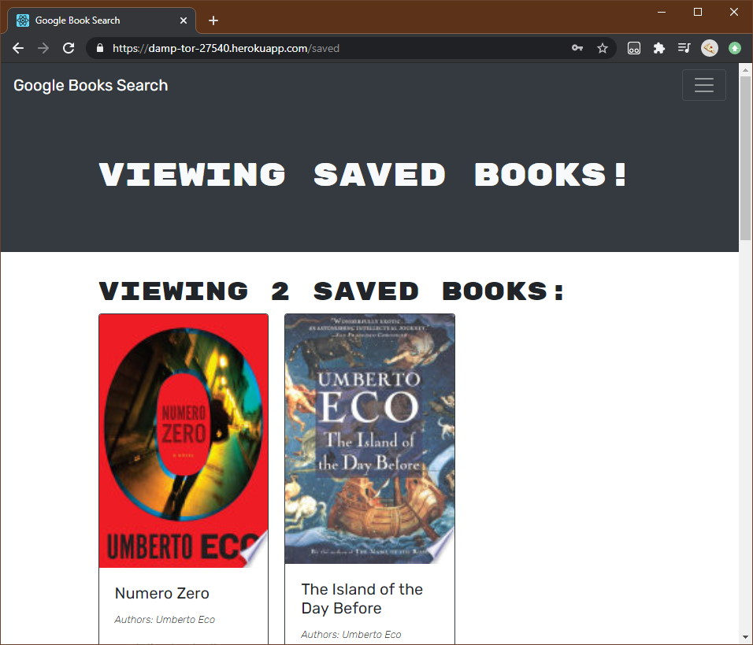

# Google Book Search

## Description

---

Search for books on Google and save them to a list of books you're planning on reading later. See it live [here](https://damp-tor-27540.herokuapp.com/)!

## Installation

---

- Install MongoDB.
- Clone this repository.
- Run `npm install`.

## Usage

---

Launch the server by typing in 'npm run start'

## Tests

---

TODO: Implement tests.

